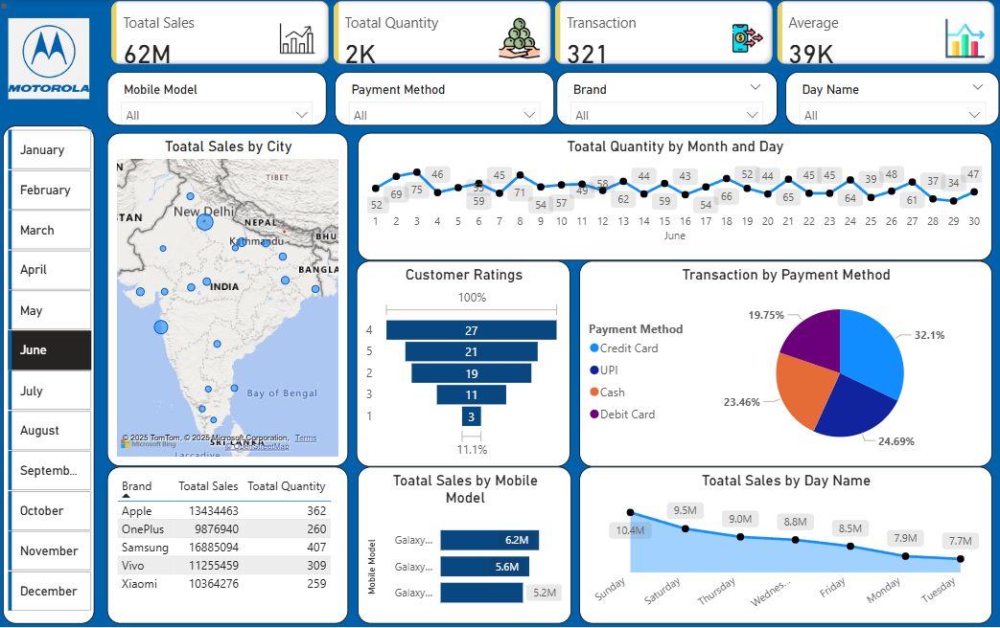

🚀 Proud to Share My New Power BI Dashboard! 📊📱

I recently created this Mobile Sales Dashboard using Microsoft Power BI, and I’m excited to showcase the results! 💥

This dashboard brings together key insights like:
🔹 Total Sales, Quantity & Transactions
🔹 Sales by Mobile Model, Brand, and City 🌍
🔹 Customer Ratings 📈
🔹 Payment Method Analysis 💳
🔹 Day-wise & Trend Visualizations 📆

🔧 Tools Used: Power BI (DAX, Data Modeling, Interactive Visuals)
💡 Key Takeaway: Turning raw data into powerful insights is incredibly rewarding.

This is just the beginning — I’m excited to continue my journey in data analytics and BI!

